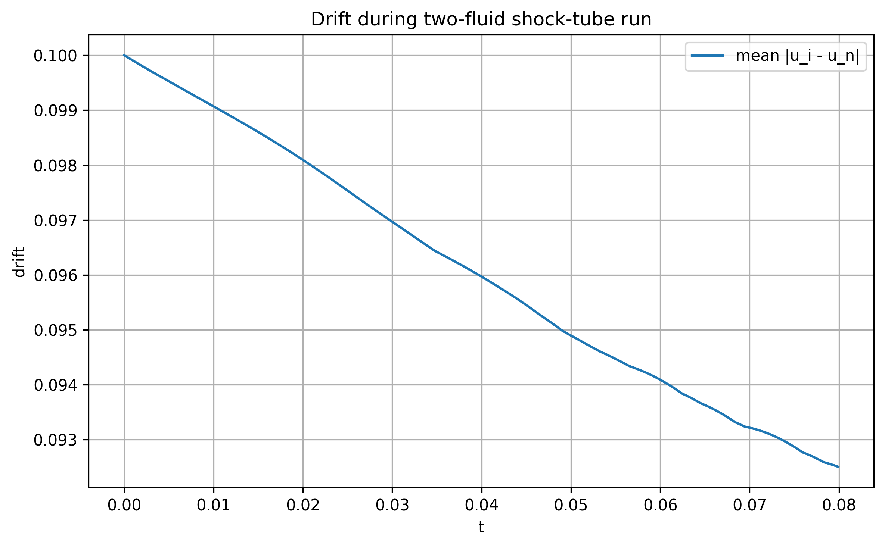
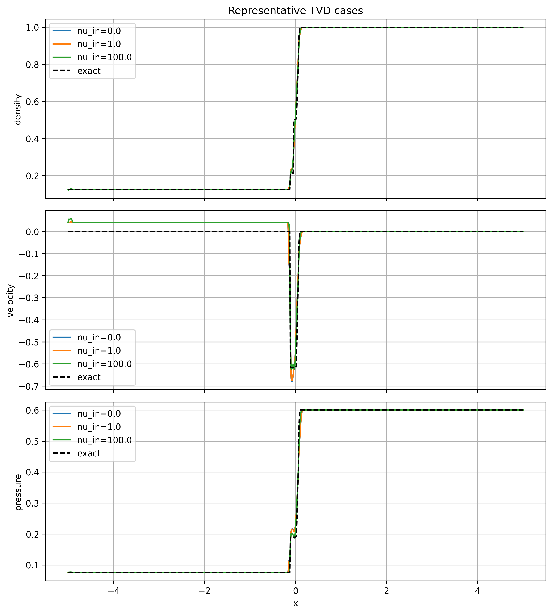
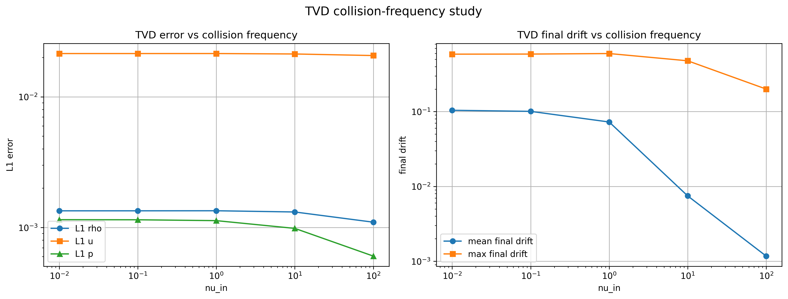
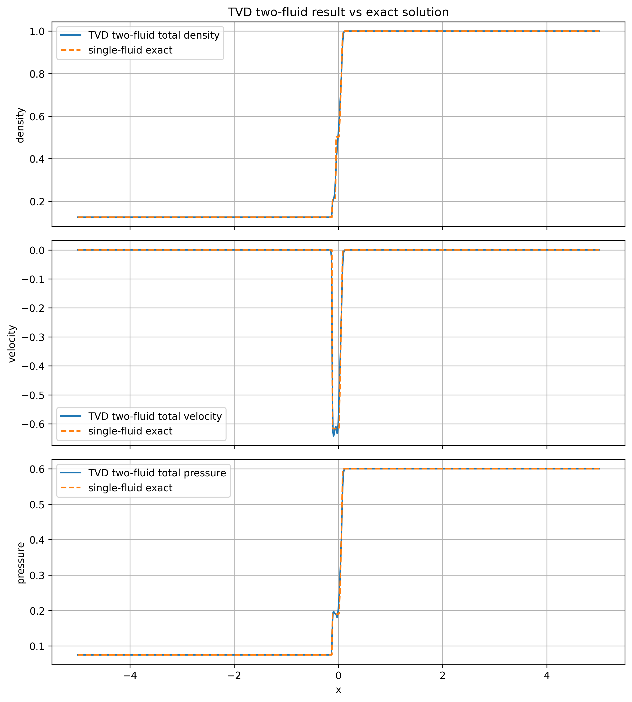
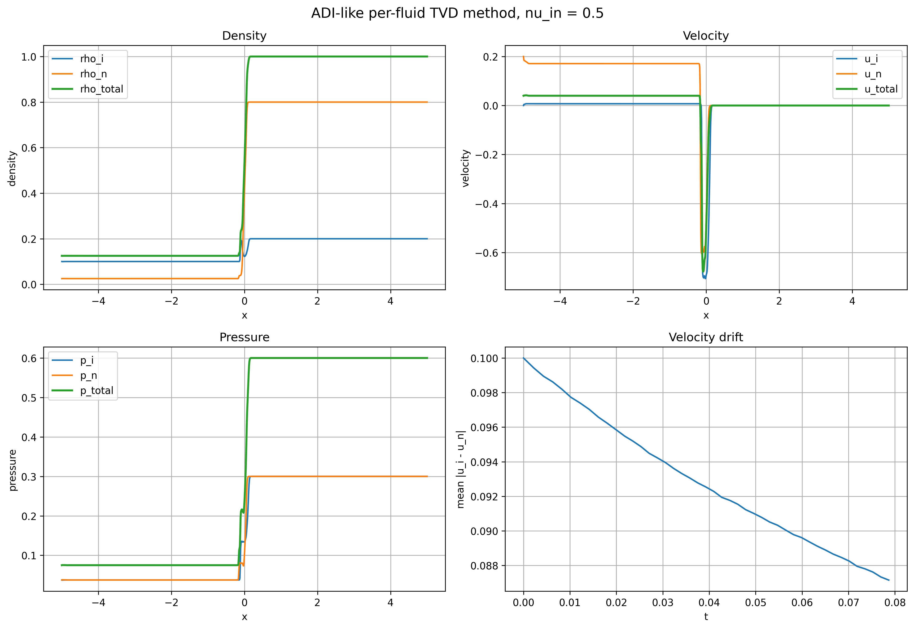
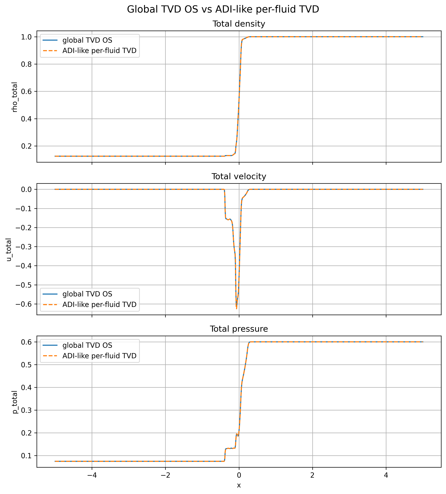
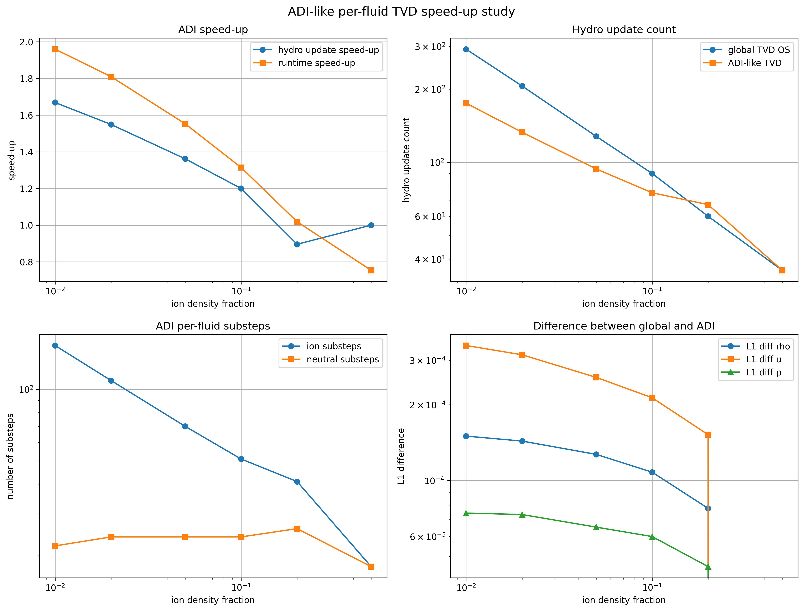
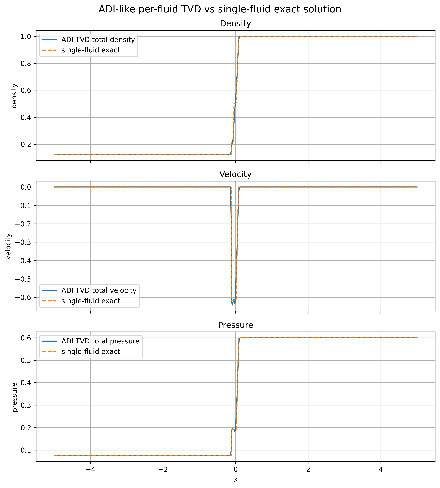

# Two-Fluid ADI-TVD Method

This repository contains a numerical implementation of a one-dimensional two-fluid hydrodynamics solver for interacting fluids, motivated by partially ionized plasma models.

The project implements a TVD finite-volume method and an ADI-like per-fluid operator-splitting method for a two-fluid Sod shock tube problem.

The code is written in Python using PyTorch, NumPy, Pandas, and Matplotlib.

## Overview

The project considers two interacting fluids, for example ions and neutrals. Each fluid has its own density, momentum, velocity, and pressure. The two fluids are coupled through a collision source term in the momentum equation.

The main goals of the project are:

- to implement a two-fluid hydrodynamical solver,
- to test velocity-drift relaxation between the fluids,
- to simulate a two-fluid Sod shock tube,
- to study the transition from collisionless to strongly coupled regimes,
- to implement a TVD MUSCL-Rusanov method,
- to implement an ADI-like per-fluid operator-splitting method,
- to compare the speed-up of the per-fluid method against a global time-step method.

## Mathematical model

For each fluid \(\alpha \in \{i,n\}\), the model uses the conservative variables

\[
U_\alpha = (\rho_\alpha, m_\alpha, E_\alpha),
\]

where

\[
m_\alpha = \rho_\alpha u_\alpha.
\]

The collision source is used to relax the relative velocity between the two fluids. In this project, the heating term is neglected, so the source step only changes the momentum while keeping the pressure fixed.

The collision source is solved using an exact relaxation step. The relative velocity satisfies approximately

\[
u_i - u_n \sim \exp[-(\nu_{in}+\nu_{ni})t].
\]

## Numerical method

The main numerical method is a finite-volume Rusanov scheme with a TVD MUSCL reconstruction using the minmod limiter.

The project includes:

1. A first-order Rusanov finite-volume baseline.
2. A TVD MUSCL-Rusanov method.
3. Exact momentum relaxation for the collision source.
4. A global operator-splitting method using a common CFL time step.
5. An ADI-like per-fluid operator-splitting method.

The ADI-like method advances each fluid over a macro time interval using its own CFL-limited substeps. This means the method is applied per fluid, not per equation component or per individual source term.

Since this project is one-dimensional, the method is not a classical spatial-direction ADI method. It is an ADI-inspired per-fluid operator-splitting method.

## Tests

### Test 1: velocity drift relaxation

The first test checks whether the velocity drift between the ion and neutral fluids decays at the expected exponential rate.

The numerical decay rate is compared with the theoretical value

\[
\lambda = \nu_{in} + \nu_{ni}.
\]



### Test 2: two-fluid Sod shock tube

The second test runs a two-fluid Sod shock tube problem for different collision frequencies.

The cases range from collisionless to strongly coupled regimes. As the collision frequency increases, the velocity drift decreases and the two fluids move more coherently.



### TVD collision-frequency study

The TVD method is tested for several collision frequencies. The error and final velocity drift are measured and compared.



### TVD result versus exact single-fluid solution

For strongly coupled cases, the total two-fluid variables are compared with the exact single-fluid Sod solution.



## ADI-like per-fluid method

The ADI-like per-fluid method is designed to reduce unnecessary updates when the two fluids have different characteristic time scales.

The global method uses

\[
\Delta t = \min(\Delta t_i, \Delta t_n),
\]

so both fluids are forced to use the smallest stable time step.

The per-fluid method instead lets each fluid evolve using its own CFL-limited substeps inside a macro time interval.

### ADI-like TVD result



### Global TVD versus ADI-like TVD

The final total density, velocity, and pressure are compared between the global TVD operator-splitting method and the ADI-like per-fluid TVD method.



### Speed-up study

The speed-up is tested by changing the ion density fraction. When the density contrast becomes stronger, the difference between the fluid time scales becomes larger, and the per-fluid method can reduce the number of hydro updates.



### ADI-like TVD versus exact single-fluid solution

For a strongly coupled case, the ADI-like TVD method is compared with the exact single-fluid Sod solution.



## Output tables

The project automatically saves summary tables for errors, drift, and speed-up tests.

Main output files include:

```text
figures/TVD_collision_frequency_table.pdf
figures/ADI_speedup_density_contrast_table.csv
figures/AST5110_norm_error_speedup_summary.pdf
```

The summary PDF contains the main norm, error, drift, and speed-up tables generated from the simulation.

## Repository structure

```text
Two-Fluid-ADI-TVD-Method/
│
├── README.md
├── TVD1.py
│
├── figures/
│   ├── 01_drift_two_fluid_shock_tube.png
│   ├── 03_representative_cases_test2.png
│   ├── 10_TVD_error_and_drift_vs_collision_frequency.png
│   ├── 19_TVD_twofluid_vs_exact.png
│   ├── 33_TVD_representative_cases.png
│   ├── 40_ADI_TVD_result_nu_0.5.png
│   ├── 41_global_TVD_vs_ADI_TVD.png
│   ├── 42_ADI_TVD_speedup_density_contrast.png
│   ├── 43_ADI_TVD_vs_exact_singlefluid.png
│   ├── ADI_speedup_density_contrast_table.csv
│   ├── AST5110_norm_error_speedup_summary.pdf
│   └── TVD_collision_frequency_table.pdf
```

## How to run

Install the required Python packages:

```bash
pip install torch numpy pandas matplotlib
```

Then run:

```bash
python TVD1.py
```

The script will run the numerical tests and save figures and tables automatically.

## Limitations

This project focuses on the no-heating case. The energy exchange term \(Q_\alpha^{\alpha\beta}\) is not fully included.

The ADI-like method implemented here is a per-fluid operator-splitting method in one spatial dimension. It should therefore be understood as ADI-inspired rather than a classical multidimensional ADI scheme.

The current implementation is mainly intended for testing and demonstration. A more advanced version could include:

- full heating and thermal energy exchange,
- higher-order time integration,
- HLL or HLLC fluxes,
- adaptive time stepping,
- multidimensional extensions,
- a cleaner modular code structure.

## Summary

This project implements and tests a two-fluid TVD solver with an ADI-like per-fluid operator-splitting method. The numerical results show velocity-drift relaxation, the transition from weakly coupled to strongly coupled two-fluid dynamics, and a measurable speed-up when different fluids have different CFL time scales.
